# OpsNotes v0.5

**Command Knowledge & Snippet Management System with draw.io diagram creation & embedding**

ホストOS（Windows / macOS / Linux）上で動作する、コマンドナレッジ & スニペット管理、および draw.io 作図・挿入機能付き Markdown メモツール。ByteStash のスニペット管理と Trilium Notes の Markdown ノートを組み合わせ、構成図の作図やデータ保全のロールバックも備えています。

<p align="center">
  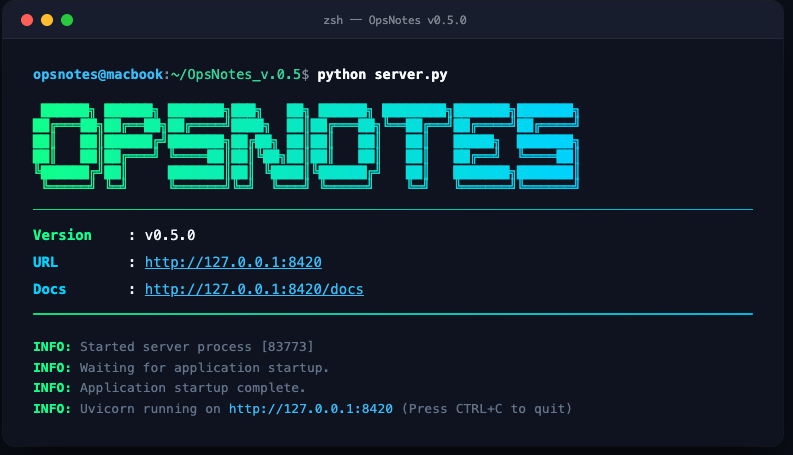
</p>

---

## 📸 画面イメージ

| コマンドスニペット管理 | Markdown メモ & draw.io 作図・挿入 |
| :---: | :---: |
|  | 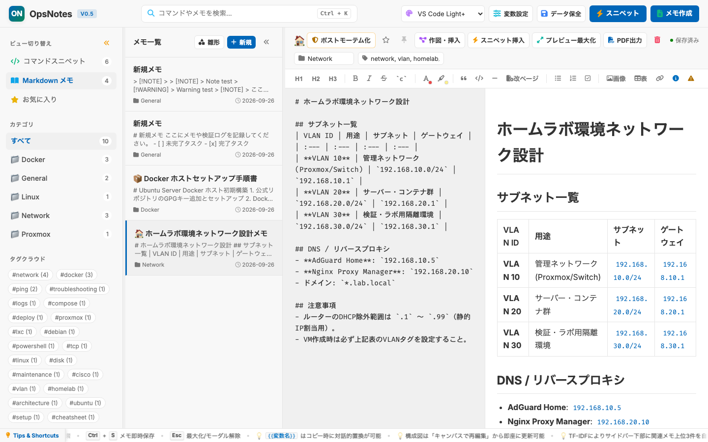 |

---

## 主な機能

**コマンドスニペット管理**
`{{TARGET_IP}}` のようなプレースホルダを書いておくと、コピー時に入力欄が出て値を埋め込める。よく使う変数はデフォルト値を登録可能。使用回数・お気に入り・ピン留めで並び替えできる。

**draw.io 作図・挿入**
メモ内から draw.io の日本語 UI をワンクリックで呼び出し、ネットワーク構成図やシステム図を直感的に作図・埋め込み可能。Cisco / AWS / Azure / GCP / Kubernetes などの公式シェイプに対応。作図結果は SVG として Markdown に即座に挿入され、後からいつでもキャンバスで再編集できる。[diagrams.net](https://www.diagrams.net/) が公式提供する埋め込み API を使用しています。

**Markdown メモ**
Split-View のライブプレビュー、500ms 間隔の自動保存、文字色・マーカーのリッチエディタ、リスト自動継続に対応。プレビューだけを A4 レイアウトで PDF 出力できる。障害対応メモはワンクリックでポストモーテムのテンプレートに展開でき、TF-IDF で内容の近いメモをサイドバーに自動表示する。

**画面・操作性**
サイドバーとメモ一覧はリサイズ・折りたたみ可能。Ctrl+K で全文検索（SQLite FTS5）。VS Code 風のテーマを複数搭載し、`styles/` に CSS を置くだけでカスタムテーマも追加できる。

**データ保全**
SQLite の WAL モードで単一ファイル管理。世代管理バックアップ（1〜100世代、既定20）と、ワンクリックのロールバックに対応。ロールバック前には直前の状態を自動退避するので誤復元しても戻せる。全データの JSON エクスポート/インポートも可能。

---

## 🎨 テーマ

VS Code Light+ をデフォルトとし、ダーク・ライト合わせて 8 種類のビルトインテーマと、`styles/` に CSS を配置するだけで追加できるカスタムテーマ（3 種類同梱）に対応しています。

### ビルトインテーマ

| VS Code Dark+ | VS Code Light+ |
| :---: | :---: |
| 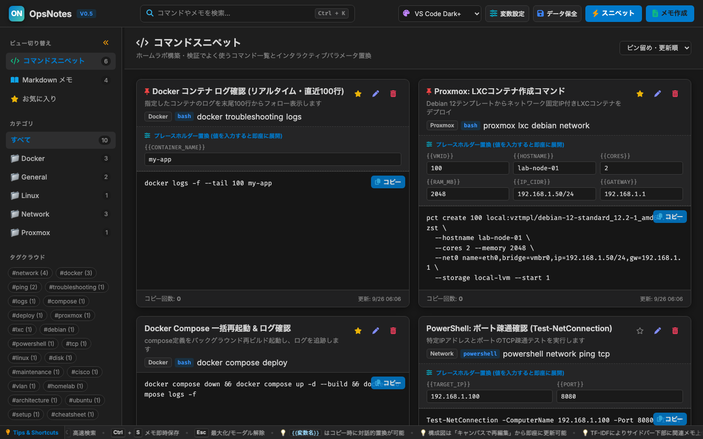 | 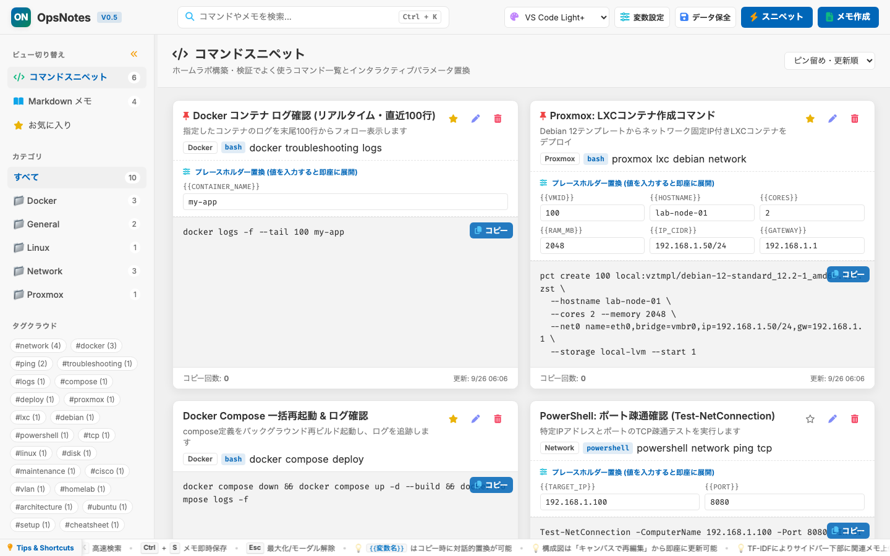 |

| Catppuccin Mocha | Catppuccin Latte |
| :---: | :---: |
| 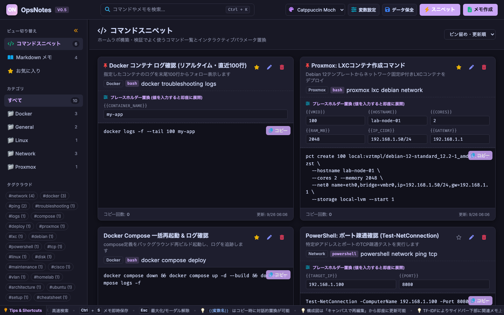 | 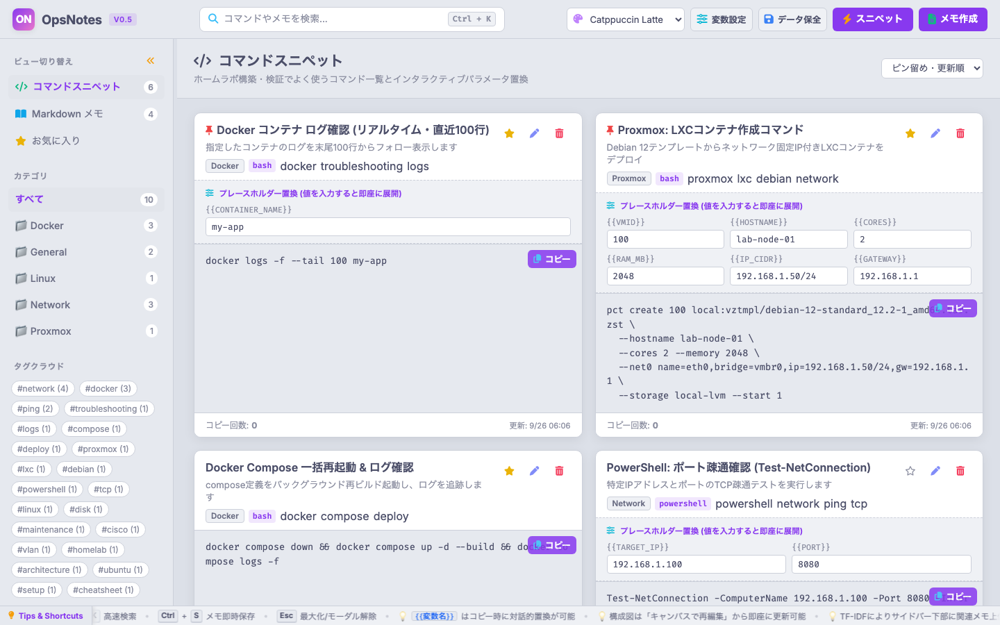 |

| Ayu Dark | Ayu Light |
| :---: | :---: |
| 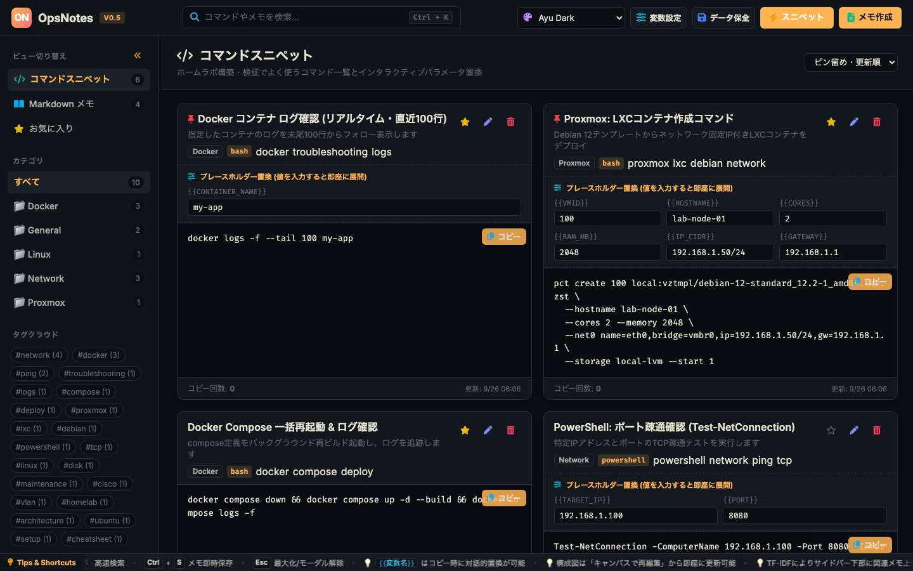 | 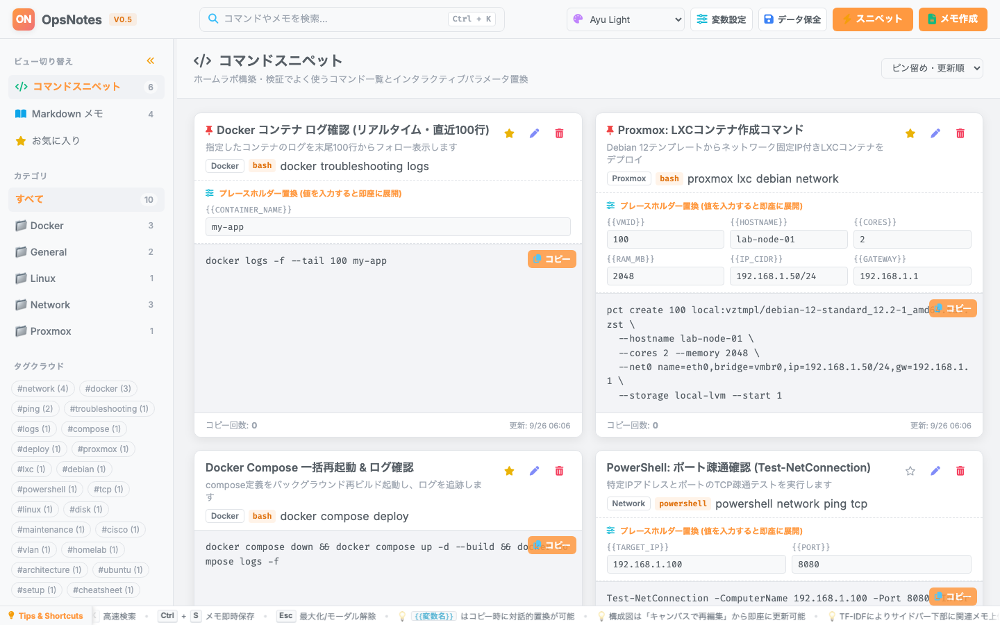 |

| Ayu Mirage | Monokai |
| :---: | :---: |
| 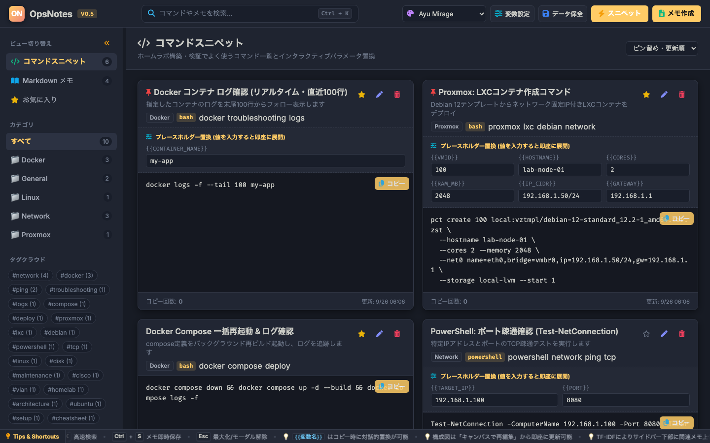 | 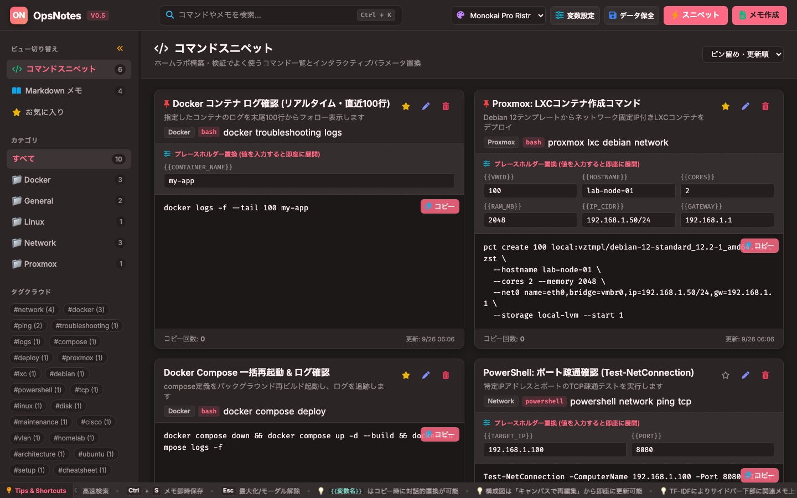 |

### カスタムテーマ（同梱）

| Dark Terminal | Kawaii Pop | Minimal |
| :---: | :---: | :---: |
| 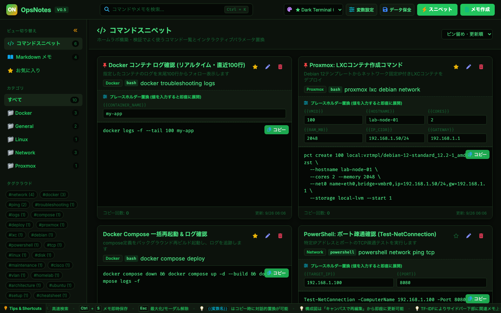 | 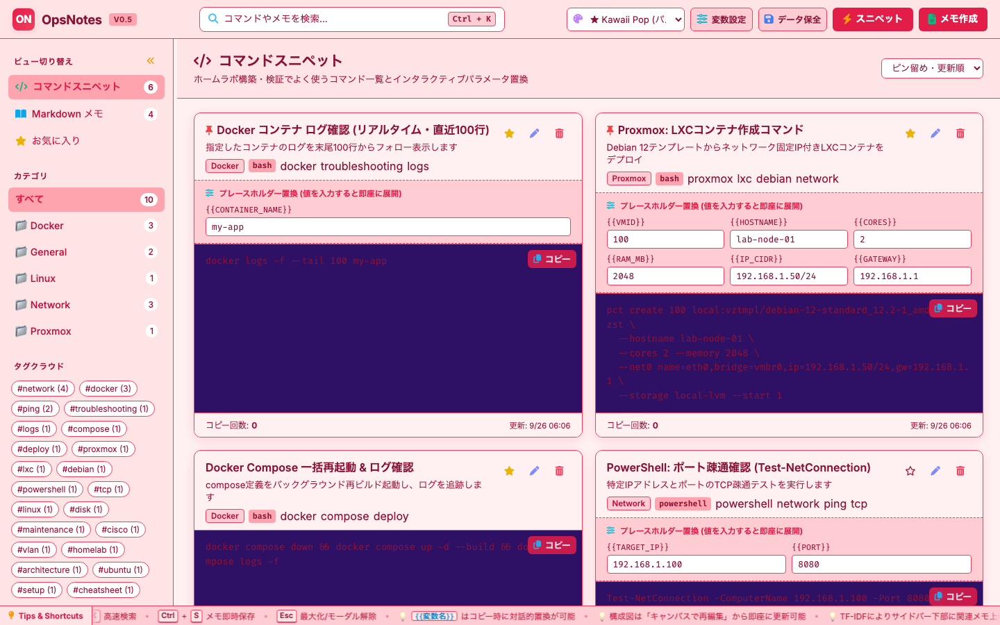 | 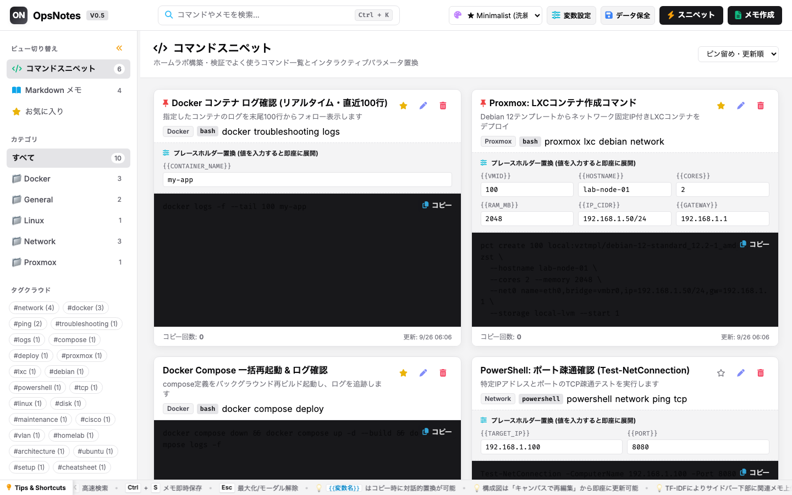 |

> テーマ配色は各プロジェクト（[Catppuccin](https://github.com/catppuccin/catppuccin)・[Ayu](https://github.com/ayu-theme/ayu-colors)・Monokai）のカラースキームを参考に実装しています。

---

## セキュリティと動作前提

OpsNotes は自分のPCの `127.0.0.1`（localhost）で単独利用する前提のツールで、認証機構はありません。`OPSNOTES_HOST` を `0.0.0.0` 等にすると、そのアドレスに到達できる人は全員データを読み書きできます（詳細は後述の環境変数の項）。

v0.4 で入れた draw.io 連携・画像アップロードに脆弱性があったため、v0.5 で以下を修正しています。

- CORS の全許可を撤去（外部サイトからの越境アクセスを遮断）
- Markdown/SVG プレビューを DOMPurify でサニタイズ（保存型XSS対策）
- 画像アップロードに10MB上限とSVG除外を追加
- draw.io の postMessage に送信元検証を追加
- 画像の実体をDBに格納し、バックアップ・エクスポート・ロールバックの対象に含める

既知の制限として、複数人が同時アクセスすると同期I/Oのためリクエストが直列化します（単独利用では影響しません）。

---

## 🚀 クイックスタート

必要なのは [uv](https://docs.astral.sh/uv/) だけです。**Python のインストールも `pip install` も不要**です。uv が適切なバージョンの Python を自動で取得し、依存ライブラリを解決します。

### 1. uv をインストール

```powershell
# Windows (PowerShell)
powershell -ExecutionPolicy ByPass -c "irm https://astral.sh/uv/install.ps1 | iex"
```

```bash
# macOS / Linux
curl -LsSf https://astral.sh/uv/install.sh | sh
```

### 2. 起動

```bash
uv run --with-requirements requirements.txt server.py
```

ブラウザで `http://127.0.0.1:8420` にアクセスしてください。

初回はPythonと依存ライブラリの取得が走りますが、2回目以降はキャッシュが効いて数秒で起動します。プロジェクト内に `.venv` は作られず、uv のキャッシュ領域で完結します。

> **補足**: システムに Python が入っていても、uv は自身が管理する Python（`~/.local/share/uv/python/`）を使うため、環境を汚しません。特定バージョンで動かしたい場合は `--python 3.11` のように指定できます。

---

## 🔧 設定（環境変数）

常駐時の挙動は環境変数で制御します。すべて省略可能です。

| 変数 | 既定値 | 説明 |
| :--- | :--- | :--- |
| `OPSNOTES_HOST` | `127.0.0.1` | 待ち受けアドレス |
| `OPSNOTES_PORT` | `8420` | 待ち受けポート |
| `OPSNOTES_RELOAD` | `0` | `1` でソース変更時の自動リロードを有効化（開発用） |
| `OPSNOTES_LOG_FILE` | (未設定) | 指定するとログをファイルへ出力（5MB×3世代でローテーション） |
| `OPSNOTES_BANNER` | `1` | `0` で起動時の ASCII アートバナー出力を無効化 |
| `OPSNOTES_BANNER_FONT` | `ansi_shadow` | バナーのフォント名（`ansi_shadow`, `speed`, `slant`, `doom` 等） |
| `OPSNOTES_BANNER_THEME` | `emerald` | バナーのカラーテーマ（`emerald`, `cyberpunk`, `sunset`, `ocean`, `matrix`） |

`.env.example` を `.env` にコピーして書き換えれば、起動のたびにシェルで指定しなくても反映されます（`.env` は git 管理外）。シェルで直接指定した場合はそちらが優先されます。

`OPSNOTES_RELOAD=1` はファイル監視の常駐プロセスが増えCPUを消費し続けるため、常駐運用では有効にしないでください。`OPSNOTES_HOST` を `0.0.0.0` にする場合は前述の「セキュリティと動作前提」を参照してください（起動時に警告ログが出ます）。

---

## ⏰ Windows で常駐させる（タスクスケジューラ）

ログオンのたびに自動起動し、コンソール画面を出さずにバックグラウンドで動かす手順です。Docker は不要で、管理者権限も要りません。

### 1. セットアップ（初回のみ）

```powershell
# uv のインストール（未導入の場合）
powershell -ExecutionPolicy ByPass -c "irm https://astral.sh/uv/install.ps1 | iex"

# プロジェクトのフォルダへ移動
cd C:\opsnotes

# 仮想環境の作成（Python 本体も uv が自動取得します）
uv venv --python 3.11
uv pip install -r requirements.txt

# ログの出力先を指定（絶対パスで指定してください）
setx OPSNOTES_LOG_FILE "C:\opsnotes\logs\opsnotes.log"
```

`setx` の設定を反映させるため、一度 PowerShell を開き直してください。

### 2. タスクとして登録

`pythonw.exe` はコンソール画面を持たない Python です。これを使うことで黒い窓が出ません。

```powershell
schtasks /create /TN "OpsNotes" /SC ONLOGON /RL LIMITED /F ^
  /TR "\"C:\opsnotes\.venv\Scripts\pythonw.exe\" \"C:\opsnotes\server.py\""
```

パスは実際の配置場所に読み替えてください。`server.py` を**絶対パスで渡すことが重要**です（タスクスケジューラは作業ディレクトリを指定できないため）。

### 3. 異常終了時の自動復旧を設定

`schtasks` コマンドでは設定できないため、GUI で行います。

1. 「タスク スケジューラ」を開き、登録した **OpsNotes** を右クリック →「プロパティ」
2. **「設定」タブ** を開く
3. 「タスクが失敗した場合の再起動間隔」に **1 分**、「再起動試行回数」に **3 回** を設定
4. 「タスクを停止するまでの時間」の**チェックを外す**（常駐させるため）

### 4. 動作確認

```powershell
# 今すぐ起動
schtasks /run /TN "OpsNotes"

# 状態の確認
schtasks /query /TN "OpsNotes" /V /FO LIST | findstr /C:"状態" /C:"前回の結果"

# ヘルスチェック（{"status":"ok"} が返れば正常）
curl http://127.0.0.1:8420/api/health
```

ブラウザで `http://127.0.0.1:8420` を開けば利用できます。

### 5. ログの確認

```powershell
Get-Content C:\opsnotes\logs\opsnotes.log -Tail 20 -Wait
```

コンソールが出ないため、動作状況の確認はこのログが頼りになります。起動に失敗する場合もここに記録されます。

### 6. 停止・削除

```powershell
schtasks /end /TN "OpsNotes"      # 停止
schtasks /delete /TN "OpsNotes" /F # タスクごと削除
```

### 補足: 応答しなくなった場合の検知

タスクスケジューラはプロセスの生死しか見ないため、「起動しているが応答しない」状態は検知できません。必要であれば、`/api/health` を定期的に確認して異常時に再起動するタスクを別途登録してください。

```powershell
# 5分ごとにヘルスチェックし、失敗したらタスクを再起動する例
schtasks /create /TN "OpsNotes-Watchdog" /SC MINUTE /MO 5 /RL LIMITED /F ^
  /TR "powershell -WindowStyle Hidden -Command \"try { Invoke-WebRequest -UseBasicParsing -TimeoutSec 10 http://127.0.0.1:8420/api/health | Out-Null } catch { schtasks /end /TN 'OpsNotes'; Start-Sleep 2; schtasks /run /TN 'OpsNotes' }\""
```

---

## 🖥️ デスクトップアプリ風に起動する方法（PWAライク）
Google Chrome または Microsoft Edge で `http://127.0.0.1:8420` を開いた状態で：
- **Edge の場合**: 画面右上のメニュー「...」→「アプリ」→「OpsNotes をアプリとしてインストール」
- **Chrome の場合**: 画面右上のメニュー「...」→「保存して共有」→「ページをアプリとしてインストール」

これでタスクバーにピン留めでき、アドレスバーのない独立したデスクトップウィンドウとして快適に利用できます。

---

## 📂 ディレクトリ構成
```
OpsNotes/
├── server.py              # FastAPI バックエンド & REST API (起動バナー機能内蔵)
├── database.py            # SQLite FTS5、データ保全・ロールバック、世代管理
├── similarity.py          # TF-IDF 関連メモ推薦エンジン
├── requirements.txt       # 依存ライブラリ (fastapi, uvicorn, pyfiglet)
├── README.md              # 仕様書 & 利用ガイド
├── docs/                  # ドキュメントアセット
│   └── images/            # README掲載用スクリーンショット
├── data/                  # データベース保管ディレクトリ
│   ├── opsnotes.db        # メインSQLiteデータベース (WAL)
│   └── backups/           # 自動バックアップ (.db)
├── styles/                # カスタムテーマCSS格納ディレクトリ
│   ├── dark-terminal.css
│   ├── kawaii.css
│   └── minimal.css
└── static/
    ├── index.html         # メインSPA UI (v0.5)
    ├── css/
    │   ├── theme.css      # テーマカラーパレット定義
    │   └── style.css      # UIスタイル・レイアウト・アニメーション
    └── js/
        ├── app.js         # メインエントリーポイント & ペインリサイズ制御
        ├── api.js         # REST API通信クライアント
        ├── themes.js      # テーマ切り替えマネージャー
        ├── snippets.js    # スニペットカード＆パラメータ置換
        ├── notes.js       # Markdownメモ・リッチエディタ・作成日時ソート
        ├── drawio.js      # draw.io 連携 & SVG埋め込み・サニタイズ
        ├── search.js      # Ctrl+K 全文検索モーダル
        └── backup.js      # データ保全・世代数設定・ロールバック制御
```
